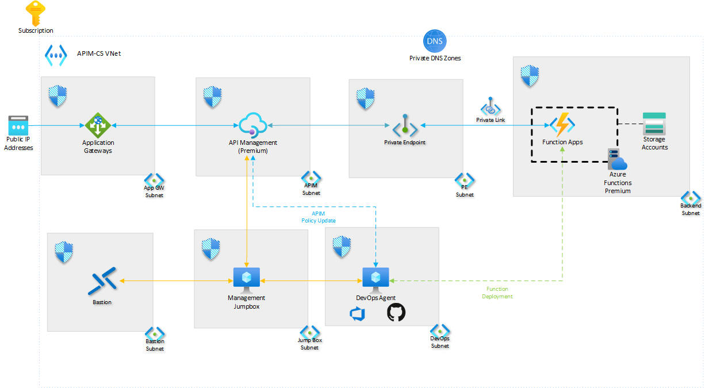

> The H1 title is the same as the title metadata. Don't enter it here, but as the **name** value in the corresponding YAML file.

This solution deploys the Enterprise Scale API Management Landing Zone a secure, opinionated accelerator enabling developers to rapidly onboard APIs to API management  [**Deploy this solution**.](#deploy-the-solution)

_Download a [Visio file](https://arch-center.azureedge.net/architecture.vsdx) that contains this architecture diagram. This file must be uploaded to `https://arch-center.azureedge.net/`_

## Architecture

The architecture leverages the following components :

### Components

- **[API Management](https://docs.microsoft.com/en-us/azure/api-management/api-management-key-concepts)** a managed service that allows customers to manage across hybrid and multi-cloud. API management acts as a facade to abstract backend architecture and provides control and security for API observability and consumption for both internal and external users.

- **[Azure Functions](https://docs.microsoft.com/en-us/azure/azure-functions/functions-overview)** a serverless solution that allows the users to focus more on blocks of code to be executed with minimal infrastructure management. Functions can be hosted in [a variety of hosting plans](https://docs.microsoft.com/en-us/azure/azure-functions/functions-scale) whereas this reference architecture uses the premium plan due to the use of private endpoints.

- **[Application Gateway](https://docs.microsoft.com/en-us/azure/application-gateway/overview)** a managed service acting as a layer 7 load balancer and [web application firewall](https://docs.microsoft.com/en-us/azure/web-application-firewall/ag/ag-overview) in this use case the application gateway protects the internal APIM instance allowing for use of internal and external mode.

- **[Azure Private DNS Zones](https://docs.microsoft.com/en-us/azure/dns/private-dns-privatednszone)** allow users to manage and resolve domain names within a virtual network without needing to implement a custom DNS solution. A Private Azure DNS zone can be aligned to one or more virtual networks through [virtual network links](https://docs.microsoft.com/en-us/azure/dns/private-dns-virtual-network-links). Due to the internal mode of the APIM instance this reference architecture uses, a private DNS zone is required.

- **[Application Insights](https://docs.microsoft.com/en-us/azure/azure-monitor/app/app-insights-overview)** is a feature of Azure Monitor that helps Developers detect anomalies, diagnose issues, and understand usage patterns with extensible application performance management and monitoring for live web apps. A variety of platforms including .NET, Node.js, Java, and Python are supported for apps that are hosted in Azure, on-prem, hybrid, or other public clouds. Application Insights is included as part of this reference architecture to monitor behaviors of the deployed application.

- **[Log Analytics](https://docs.microsoft.com/en-us/azure/azure-monitor/logs/log-analytics-overview)** is a feature of Azure Monitor that allows users to edit and run log queries with data in Azure Monitor Logs, optionally from within the Azure portal. Developers can run simple queries for a set of records or use Log Analytics to perform advanced analysis and visualize the results. Log Analytics is configured as part of this reference architecture to aggregate all the monitoring logs for additional analysis and reporting.

- **[Azure Virtual Machine](https://docs.microsoft.com/en-us/azure/virtual-machines/windows/overview)** is an on-demand, scalable computing resource that can be used to host a number of different workloads. In this reference architecture, virtual machines are used to provide a management jumpbox server, as well as a host for the DevOps Agent / GitHub Runner.

- **[Azure Key Vault](https://docs.microsoft.com/en-us/azure/key-vault/general/basic-concepts)** is a cloud service to securely store and access secrets, ranging from API keys and passwords to certificates and cryptographic keys. While this reference architecture does not store secrets in the Key Vault as part of the infrastructure deployment of this reference architecture, the Key Vault is deployed to facilitate secret management for future code deployments.

- **[Azure Bastion](https://docs.microsoft.com/en-us/azure/bastion/bastion-overview)** is a Platform-as-a-Service service provisioned within the developer's virtual network which provides secure RDP/SSH connectivity to the developer's virtual machines over TLS from the Azure portal. With Azure Bastion, virtual machines no longer require a public IP address to connect via RDP/SSH. This reference architecture uses Azure Bastion to access the DevOps Agent / GitHub Runner server or the management jump box server.

## Recommendations

The following recommendations apply for the majority of scenarios. Follow these recommendations unless you have a specific requirement that overrides them.

_Include considerations for deploying or configuring the elements of this architecture._

## Identity and Access Management

[Design Recommendations](/docs/Design-Areas/identity-access-mgmt.md)

### Design Considerations

- Decide on the access management for APIM services through all possible channels like portal, ARM REST API, DevOps etc.
- Decide on the access management for APIM entities.
- Decide on [how to sign up and authorize the developer accounts](https://docs.microsoft.com/en-us/azure/api-management/api-management-howto-create-or-invite-developers).
- Decide on how subscriptions are used.
- Decide on the visibility of [products](https://docs.microsoft.com/en-us/azure/api-management/api-management-key-concepts#--products) and APIs on the developer portal using [groups](https://docs.microsoft.com/en-us/azure/api-management/api-management-key-concepts#--groups).
- Decide on access revocation policies.
- Decide on reporting requirements for access control.

### Design Recommendations

- Using [built-in roles](https://docs.microsoft.com/en-us/azure/api-management/api-management-role-based-access-control#built-in-roles) to control access to APIM service to delegate responsibilities across teams to manage the APIM instance.
- Using custom roles using API Management [RBAC Operations](https://docs.microsoft.com/en-us/azure/role-based-access-control/resource-provider-operations#microsoftapimanagement) to set fine-grained access to APIM entities. For example. API developers, Backup operators, DevOps Automation, etc.
- Associate subscriptions at the appropriate scope like products.
- Create appropriate [groups](https://docs.microsoft.com/en-us/azure/api-management/api-management-howto-create-groups) to control the visibility of the products.
- Manage access to the developer portal using [Azure Active Directory B2C](https://docs.microsoft.com/en-us/azure/api-management/api-management-howto-aad-b2c).
- Use [managed identity](https://docs.microsoft.com/en-us/azure/api-management/api-management-howto-use-managed-service-identity) for the APIM instance to access other Azure resources.

## Network Topology and Connectivity

[Design Recommendations](/docs/Design-Areas/networking.md)

### Design Considerations

=======
## Scalability considerations

- Deploy at least two scale units spread over two AZs per region for best availability and performance

## Availability considerations

<<<<<<< HEAD
- Use [Application Gateway for external access of an internal APIM instance](https://docs.microsoft.com/en-us/azure/api-management/api-management-howto-integrate-internal-vnet-appgateway)
- Deploy the gateway in a vnet to allow access to backend services in the network
- VNet peering provides great performance in a region but has a scalability limit of max 500 networks, if you require more workloads to be connected, use [hub spoke](https://docs.microsoft.com/en-us/azure/architecture/reference-architectures/hybrid-networking/hub-spoke?tabs=cli) or PLE
=======
- Determine the Recovery Time Objective (RTO) and Recovery Point Objective (RPO) for the APIM instance(s) that we want to protect and the value chains they support (consumers &amp; providers). Consider the feasibility of deploying fresh instances or having a hot / cold standby.
- APIM can be [backed up using its Management REST API](https://docs.microsoft.com/en-us/azure/api-management/api-management-howto-disaster-recovery-backup-restore#calling-the-backup-and-restore-operations). Backups expire after 30 days. Be aware of [what APIM does not back up](https://docs.microsoft.com/en-us/azure/api-management/api-management-howto-disaster-recovery-backup-restore#what-is-not-backed-up)

- Decide if the APIs are accessible externally or internally
- Decide if private end point connectivity is required
- Decide how to connect to external (3rd party) workloads
- Decide whether [virtual network connection](https://docs.microsoft.com/en-us/azure/api-management/api-management-using-with-vnet?tabs=stv2#enable-vnet-connection) is required and the access type for virtual network connection ([external](https://docs.microsoft.com/en-us/azure/api-management/api-management-using-with-vnet?tabs=stv2#enable-vnet-connection) or [internal](https://docs.microsoft.com/en-us/azure/api-management/api-management-using-with-internal-vnet)).
- Decide whether connectivity to on-premises or multi-cloud environments is required.
>>>>>>> 2ee0d56e9ba51a7c79ca58e37aa0ec39fc332b53

- Decide if [multi-region deployment](https://docs.microsoft.com/en-us/azure/api-management/api-management-howto-deploy-multi-region) is required to service geographically distributed API consumers.
- Consider using a load balancing solution such as [Application Gateway](https://docs.microsoft.com/en-us/azure/application-gateway/overview) or [Azure Front Door](https://docs.microsoft.com/en-us/azure/frontdoor/front-door-overview).

### Design Recommendations

- Use [Application Gateway for external access of an internal APIM instance](https://docs.microsoft.com/en-us/azure/api-management/api-management-howto-integrate-internal-vnet-appgateway)
- Use Azure Front Door for multi-region deployment
- Ensure [required ports](https://docs.microsoft.com/en-us/azure/api-management/api-management-using-with-vnet?tabs=stv2#required-ports) (ie. 80, 443) are open between the calling client and the backend APIM gateway
- Deploy the gateway in a vnet to allow access to backend services in the network
- VNet peering provides great performance in a region but has a scalability limit of max 500 networks, if you require more workloads to be connected, use [hub spoke](https://docs.microsoft.com/en-us/azure/architecture/reference-architectures/hybrid-networking/hub-spoke?tabs=cli) or PLE
- When used in internal mode, make it easy for consumers to onboard (connect) to you APIM platform, hence provide an open network path (either through upstream hub) or NSG setup to remove friction when connecting to APIM

## Management and Monitoring

[Design Recommendations](/docs/Design-Areas/mgmt-monitoring.md)

### Design Considerations

- Be aware of maximum[ throughput limits](https://azure.microsoft.com/en-us/pricing/details/api-management/) of each APIM SKU
- Be aware of the maximum number of [scale-out units](https://azure.microsoft.com/en-us/pricing/details/api-management/) per APIM SKU
- Be aware of the maximum throughputs are approximate and not guarantees
- Be aware of the time required to scale-out, deploy into another region, or convert from deployment types
- Consider the number of service units required through [configuration](https://docs.microsoft.com/en-us/azure/api-management/upgrade-and-scale#scale-your-api-management-service) or [auto-scaling](https://docs.microsoft.com/en-us/azure/api-management/api-management-howto-autoscale)
- APIM does not scale-out automatically, additional configuration is required.
- There is no downtime during a scale-out event
- Only the gateway component of API Management is deployed to all regions in a multi-region deployment.
- Be aware of the possible performance impact of AppInsights logging at high loads.
- Be aware that the number of inbound and outbound policies applied and their impact to performance
- Consider using policies for [access restriction](https://docs.microsoft.com/en-us/azure/api-management/api-management-access-restriction-policies#AccessRestrictionPolicies), [authentication](https://docs.microsoft.com/en-us/azure/api-management/api-management-authentication-policies#AuthenticationPolicies), [caching](https://docs.microsoft.com/en-us/azure/api-management/api-management-caching-policies#CachingPolicies), [cross domain](https://docs.microsoft.com/en-us/azure/api-management/api-management-cross-domain-policies#CrossDomainPolicies), [transformation](https://docs.microsoft.com/en-us/azure/api-management/api-management-transformation-policies#TransformationPolicies), [Dapr integration](https://docs.microsoft.com/en-us/azure/api-management/api-management-dapr-policies), and [validation](https://docs.microsoft.com/en-us/azure/api-management/validation-policies)
- Policies are code and should be under version control
- APIM's built-in cache is shared by all units in the same region in the same API Management service.
- Utilize [Availability Zones](https://docs.microsoft.com/en-us/azure/api-management/zone-redundancy), the number of Units selected must distribute evenly across the zones
- Self-hosted gateway's credentials expire every 30 days and must be rotated.
=======

## Manageability considerations

- APIM configurations are represented as ARM templates and an infrastructure-as-code mindset should be embraced.
- The Uri /status-0123456789abcdef can be used as a common health endpoint for the APIM service.
- The APIM Service is not a WAF. Deploy Azure App Gateway in front to add additional layers of protection
- Client certificate negotiation is enabled is a per-gateway configuration
- Certificates updated in the key vault are automatically rotated in API Management and is updated within 4 hours.
- Utilize Key Vault for Certificate storage, notification, and rotation

### Design Recommendations

- Apply custom domains to the Gateway endpoint only
- Use [Event Hub policy](https://docs.microsoft.com/en-us/azure/api-management/api-management-log-to-eventhub-sample) for logging at high performance levels
- Utilize an [external cache](https://docs.microsoft.com/en-us/azure/api-management/api-management-howto-cache-external) for control and fastest performance
- Deploy at least two scale units spread over two AZs per region for best availability and performance
- Utilize Azure Monitor to Autoscale APIM. If using a self-hosted gateway, use Kubernetes Horizonal Pod Autoscaler to scale out the gateway
- Deploy self-host gateways where Azure does not have a region close to the back-end API
- Utilize Key Vault for Certificate storage, notification, and rotation
- Do not enable 3DES, TLS1.1 or lower encryption protocols unless absolutely required.
- Utilize DevOps and Infrastructure-As-Code practices to handle all deployments, updates, and DR.
- Create an API revision and Change Log entry for every API update.
- Utilize [Backends](https://docs.microsoft.com/en-us/azure/api-management/backends) to eliminate redundant API backend configurations.
- Utilize[ Named-Values](https://docs.microsoft.com/en-us/azure/api-management/api-management-howto-properties?tabs=azure-portal#add-or-edit-a-named-value) to store common values that can be used in policies.
- Utilize Key Vault to store secrets that Named-Values can reference.
- Secrets updated in the key vault are automatically rotated in API Management.
- Develop communication strategy to notify users of breaking API version update.
- Set diagnostic settings to forward AllMetrics and AllLogs to Log Analytics workspace
- Reporting
  - Make use of [built-in analytics](https://docs.microsoft.com/en-us/azure/api-management/howto-use-analytics)
  - Review Audit logs
  - Create custom reports
  - Configure [cloud logs for self-hosted gateway](https://docs.microsoft.com/en-us/azure/api-management/how-to-configure-local-metrics-logs) or [local logs for self-hosted gateway on Kubernetes clusters](https://docs.microsoft.com/en-us/azure/api-management/how-to-configure-local-metrics-logs)

## Business Continuity and Disaster Recovery

[Design Recommendations](/docs/Design-Areas/BCDR.md)

### Design Consideration

- Determine the Recovery Time Objective (RTO) and Recovery Point Objective (RPO) for the APIM instance(s) that we want to protect and the value chains they support (consumers &amp; providers). Consider the feasibility of deploying fresh instances or having a hot / cold standby.
- APIM supports multi zone and multi region deployments, based on the requirements these could be enabled just one or both.
- Failover could be automated
  - Multi AZ automatically fails over,
  - Multi region will require a DNS based GLB such as Traffic manager to fail over.
- APIM can be [backed up using its Management REST API](https://docs.microsoft.com/en-us/azure/api-management/api-management-howto-disaster-recovery-backup-restore#calling-the-backup-and-restore-operations). Backups expire after 30 days. Be aware of [what APIM does not back up](https://docs.microsoft.com/en-us/azure/api-management/api-management-howto-disaster-recovery-backup-restore#what-is-not-backed-up)

### Design Recommendation

- Use User assigned managed identity for APIM to prevent downtime during redeployment of APIM from ARM templates
- Use automated DevOps pipelines to run backups
- Decide on whether [multi-region deployment](https://docs.microsoft.com/en-us/azure/api-management/api-management-howto-deploy-multi-region) is required

## Security, Governance, and Compliance

[Design Recommendations](/docs/Design-Areas/security-governance-compliance.md)

### Design Considerations

=======
## Security considerations

<<<<<<< HEAD
- API Management [validation policies](https://docs.microsoft.com/en-us/azure/api-management/validation-policies) are available to validate API requests and responses against an OpenAPI schema. These are not a replacement for a [Web Application Firewall](https://docs.microsoft.com/en-us/azure/web-application-firewall/overview) but can provide additional protection against some threats. Note that adding validation policies can have performance implications, so we recommend performance load tests to assess their impact on API throughput.
- Deploy a Web Application Firewall (WAF) in front of API Management to provide protection against common web application exploits and vulnerabilities.
=======
>>>>>>> 154c99267106e7657e01dc3020227e92fe6a1eb8
- Research the available [built-in RBAC roles](https://docs.microsoft.com/en-us/azure/api-management/api-management-role-based-access-control#built-in-roles) available for the API Management service
- Consider using [built-in Azure Policies](https://docs.microsoft.com/en-us/azure/api-management/policy-reference) to govern the APIM instance
- Consider what level of logging is necessary to meet your organization’s compliance requirements.
- Consider how you want to secure your frontend APIs beyond using subscription keys. OAuth 2.0, OpenID Connect, and mutual TLS are common options with built-in support.
- Think about how you want to protect your backend services behind API Management. Client certificates and OAuth 2.0 are two supported options.
- Consider which client and backend [protocols and ciphers](https://docs.microsoft.com/en-us/azure/api-management/api-management-howto-manage-protocols-ciphers) are required to meet your security requirements.
- API Management [validation policies](https://docs.microsoft.com/en-us/azure/api-management/validation-policies) are available to validate API requests and responses against an OpenAPI schema. These are not a replacement for a [Web Application Firewall](https://docs.microsoft.com/en-us/azure/web-application-firewall/overview) but can provide additional protection against some threats. Note that adding validation policies can have performance implications, so we recommend performance load tests to assess their impact on API throughput.
- Consider which identity providers besides Azure AD need to be supported.
- Consider how non-compliance should be detected.
- Consider how to standardize error responses returned by APIs.

### Design Recommendations

- Deploy a Web Application Firewall (WAF) in front of API Management to provide protection against common web application exploits and vulnerabilities.
- Use [Azure Key Vault](https://docs.microsoft.com/en-us/azure/key-vault/general/basic-concepts) to securely store and manage secrets and make them available through named values within API Management.
- Create a system assigned Managed Identity within API Management to establish trust relationships between the service and other resources protected by Azure Active Directory, including Key Vault and backend services.
- Use Azure [built-in roles](https://docs.microsoft.com/en-us/azure/api-management/api-management-role-based-access-control#built-in-roles) to provide least privilege permissions to manage the API Management service.
- Configure diagnostics settings within API Management to output logs and metrics to Azure Monitor.
- APIs should only be accessible over HTTPS to protect data in-transit and ensure its integrity.
- Use the latest TLS version when encrypting information in transit and disable outdated and unnecessary protocols and ciphers when possible.
- Implement an error handling policy at the global level.
- All policies should call "<base/ >"
- Do not enable 3DES, TLS1.1 or lower encryption protocols unless absolutely required.

## Application Automation and DevOps

[Design Recommendations](/docs/Design-Areas/automation-devops.md)

### Design Considerations

- Each API team can push updates from their own developer repo to their own development APIM instance.
  - What does this mean from a network planning perspective?
  - What about other non prod environments (QA, Staging etc)
- Consider how products etc should be managed/versioned especially if multiple teams use the same products.
- Consider the testing strategy for API and policies.
### Design Recommendations

- A central team (e.g. APIM admin team) manages the production APIM environment.
- APIM configurations are represented as ARM templates and an infrastructure-as-code mindset should be embraced.
- The APIM admin team will publish configuration changes to the production APIM environment from a Git repository (publisher repo) owned by the APIM admin team.
- Each individual API team may fork the publisher repo to have their own developer repo to work from.
- Each team can use the APIM Reskit  or the VS Code APIM extension to extract the relevant artifacts from their development APIM instance. These artifacts are based on ARM and should be committed to the API team’s Git repo.
  - Do not use the [Git integration](https://docs.microsoft.com/en-us/azure/api-management/api-management-configuration-repository-git)
- Service Templates and Shared templates should be in a separate repo
- Use the [“Extract all APIs with seperated api folders“ option](https://github.com/Azure/azure-api-management-devops-resource-kit/blob/master/src/README.md#extractor)
- Changes to artifacts should be done to the extracted artifacts and then committed to Git. These should be deployed to a dev environment
- To promote to the centralized environments (staging, production), API teams can submit a pull request (PR) to merge their changes to the publisher repo.
- The APIM admin team validates the PR.
  - Ideally most of the validations are automated as part of submitting a PR.
- The IAC templates should be in a different repo – and deployed in a deployment pipeline
  - Separate infrastructure deployment from application deployment. Core infrastructure changes less than applications. Treat each type of deployment as a separate flow and pipeline.
- Once changes are approved and merged successfully, the APIM admin team can deploy the changes to the centrally managed environment (staging, production) in coordination with agreed-upon API team schedules.
=======
- Decide on the access management for APIM services through all possible channels like portal, ARM REST API, DevOps etc.
- Decide on the access management for APIM entities.
- Decide on [how to sign up and authorize the developer accounts](https://docs.microsoft.com/en-us/azure/api-management/api-management-howto-create-or-invite-developers).
- Decide on how subscriptions are used.
- Decide on the visibility of [products](https://docs.microsoft.com/en-us/azure/api-management/api-management-key-concepts#--products) and APIs on the developer portal using [groups](https://docs.microsoft.com/en-us/azure/api-management/api-management-key-concepts#--groups).
- Decide on access revocation policies.
- Decide on reporting requirements for access control.
>>>>>>> 2ee0d56e9ba51a7c79ca58e37aa0ec39fc332b53

## Deploy this scenario

To deploy the API management landing zone accelerator there are several methodologies you can choose from. Select one from the list below and follow the deployment steps.

| Deployment Methodology| GitHub Action YAML| User Guide|
|--------------|--------------|--------------|
| [Bicep](/reference-implementations/AppGW-IAPIM-Func/bicep) |[es-apim.yml](/.github/workflows/es-apim.yml)| [README](/docs/README.md)
| ARM (Coming soon) ||
| Terraform (Coming soon)||

## Next steps

Link to Docs and Learn articles. Could also be to appropriate sources outside of Docs, such as GitHub repos, third-party documentation, or an official technical blog post.

Examples:

- [Azure Machine Learning documentation](/azure/machine-learning)
- [What are Azure Cognitive Services?](/azure/cognitive-services/what-are-cognitive-services)

## Related resources

Use "Related resources" for architecture information that's relevant to the current article. It must be content that the Azure Architecture Center TOC refers to, but may be from a repo other than the AAC repo.

Links to articles in the AAC repo should be repo-relative, for example (../../solution-ideas/articles/article-name.yml).

Here is an example section:

Fully deployable architectures:

- [Chatbot for hotel reservations](/azure/architecture/example-scenario/ai/commerce-chatbot)
- [Build an enterprise-grade conversational bot](/azure/architecture/reference-architectures/ai/conversational-bot)
- [Speech-to-text conversion](/azure/architecture/reference-architectures/ai/speech-ai-ingestion)