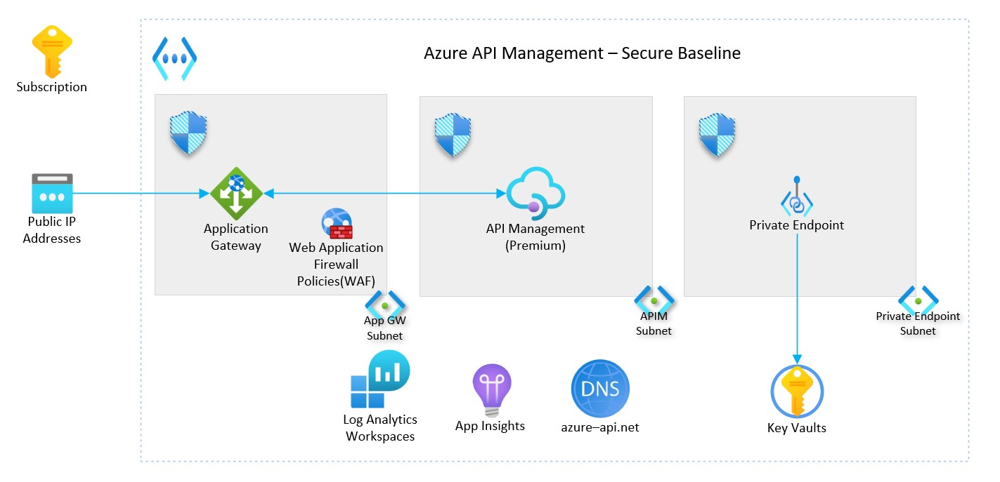

# Scenario 1: Azure API Management - Secure Baseline

This reference implementation demonstrates a *secure baseline infrastructure architecture* for provisioning [Azure API Management](https://learn.microsoft.com/azure/api-management/). Specifically this scenario addresses deploying Azure API Management into a [virtual network](https://learn.microsoft.com/azure/api-management/api-management-using-with-internal-vnet?tabs=stv2), in an internal mode where you can only access the API Management endpoints like API gateway, developer portal, Direct management and Git within a VNet whose access you control.

By the end of this deployment guide, you would have deployed an "internal mode" Azure API Management premium instance.

## Core architecture components

- Azure API Management (Developer SKU)
- Azure Virtual Networks
- Azure Application Gateway (with Web Application Firewall)
- Azure Standard Public IP
- Azure Key Vault
- Azure Private Endpoint
- Azure Private DNS Zones
- Log Analytics Workspace
- Azure Application Insights

## Deploy the reference implementation

This reference implementation is provided with the following infrastructure as code options. Select the deployment guide you are interested in. They both deploy the same implementation.

:arrow_forward: [Bicep-based deployment guide](./bicep/README.md)
:arrow_forward: [Terraform-based deployment guide](./terraform/README.md)
