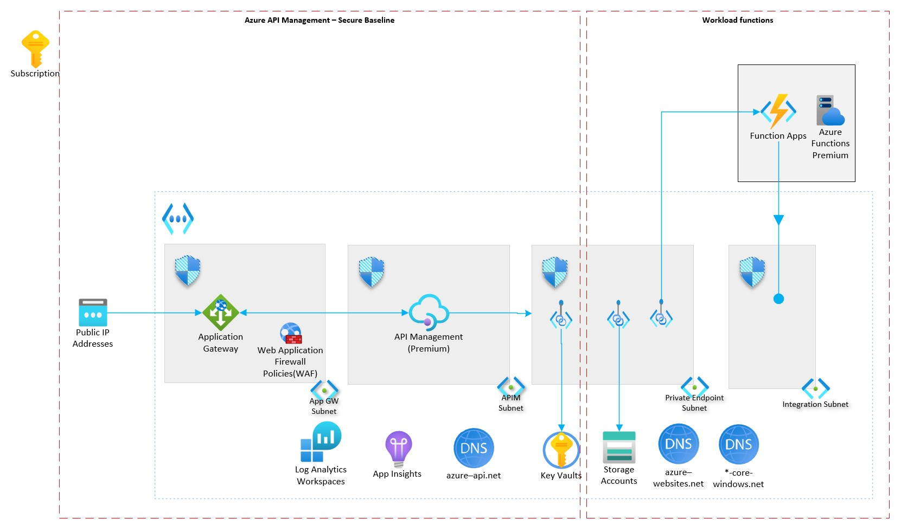

# Scenario 2: Azure API Management - Azure Functions as backend

This reference implementation demonstrates how to provision a single region API Management instance within an internal VNet exposed through Application Gateway for external traffic with Azure Functions as the backend (exposed through private endpoint). This scenario is built on top of the [apim secure baseline](../apim-baseline/README.md) scenario.

By the end of this deployment guide, you would have deployed an an private Azure functions backend that is available publicly through Application Gateway and manged by API Management.

## Core architecture components

- Azure Functions
- Azure Private Endpoint
- Azure Private DNS Zones

## Deploy the reference implementation

This reference implementation is provided with the following infrastructure as code options. Select the deployment guide you are interested in. They both deploy the same implementation.

:arrow_forward: [Bicep-based deployment guide](./bicep/README.md)
:arrow_forward: Terraform-based deployment guide (Work in progress)
