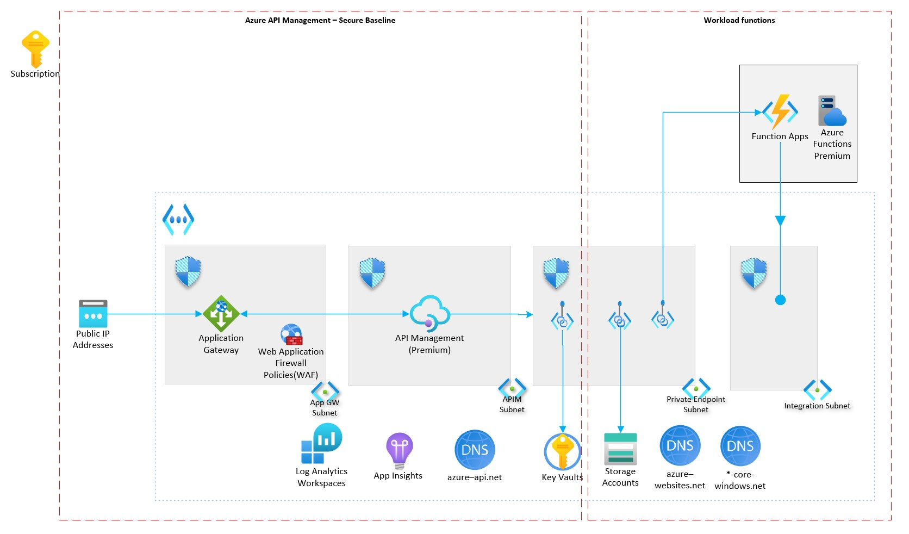

# Scenario 2: Azure API Management - Azure Functions as backend

This reference implementation demonstrates how to provision a single region API Management instance within an internal VNet exposed through Application Gateway for external traffic with Azure Functions as the backend (exposed through private endpoint).

## Pre-Requisites

- An Azure Subscription
- An active GitHub repository

## Tooling

- [Az CLI](https://learn.microsoft.com/en-us/cli/azure/install-azure-cli) latest version
OR
- Azure [cloud shell](https://shell.azure.com/)

## Deployment Steps

By the end of this deployment guide, you would have deployed an "internal mode" Azure API Management premium instance. 

## Core architecture components

- Azure API Management (Premium)
- Azure Virtual Networks
- Azure Application Gateway (with Web Application Firewall)
- Azure Standard Public IP (with [DDoS protection](https://learn.microsoft.com/azure/ddos-protection/ddos-protection-sku-comparison#skus))
- Azure Functions
- Azure Key Vault
- Azure Private Endpoint
- Azure Private DNS Zones
- Log Analytics Workspace
- Azure Application Insights

All resources have enabled their Diagnostics Settings (by default sending the logs to a Log Analytics Workspace).

All the resources that support Zone Redundancy (i.e. Container Apps Environment, Application Gateway, Standard IP) are set by default to be deployed in all Availability Zones. If you are planning to deploy to a region that is not supporting Availability Zones you need to set the  parameter  `deployZoneRedundantResources` to `false`. 

## Deploy the reference implementation

This reference implementation is provided with the following infrastructure as code options. 
@seenu433 - please update