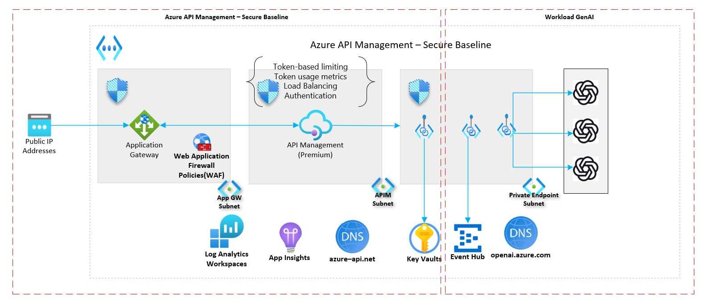

# GenAI Gateway using APIM

- [GenAI Gateway using APIM](#genai-gateway-using-apim)
  - [Introduction](#introduction)
  - [Getting Started](#getting-started)
    - [Deploy the reference implementation](#deploy-the-reference-implementation)
  - [Architecture Diagram](#architecture-diagram)
  - [GenAI Gateway capabilities](#genai-gateway-capabilities)
    - [Test/Demo setup](#testdemo-setup)
  - [AI Hub Gateway capabilities](#ai-hub-gateway-capabilities)

## Introduction

A "GenAI Gateway" serves as an intelligent interface/middleware that dynamically balances incoming traffic across backend resources to achieve optimizing resource utilization. In addition to load balancing, GenAI Gateway can be equipped with extra capabilities to address the challenges around billing, monitoring etc.

To read more about considerations when implementing a GenAI Gateway, see [this article](https://learn.microsoft.com/ai/playbook/technology-guidance/generative-ai/dev-starters/genai-gateway/).

This accelerator contains APIM policies showing how to implement different [GenAI Gateway capabilities](#genai-gateway-capabilities) in APIM, along with code to enable you to deploy the policies and see them in action.

## Getting Started

### Deploy the reference implementation

This reference implementation is provided with the following infrastructure as code options. Select the deployment guide you are interested in. They both deploy the same implementation.

:arrow_forward: [Bicep-based deployment guide](./bicep/README.md)
:arrow_forward: Terraform-based deployment guide (Work in progress)

## Architecture Diagram

## GenAI Gateway capabilities

This repo currently contains the policies showing how to implement these GenAI Gateway capabilities:

| Capability                                                                      | Description                                                             |
| ------------------------------------------------------------------------------- | ----------------------------------------------------------------------- |
| [Load balancing (round-robin)](./capabilities/load-balancing-round-robin/Readme.md) | Load balance traffic across PAYG endpoints using simple and weighted round-robin algorithm. |
| [Managing spikes with PAYG](./capabilities/manage-spikes-with-payg/README.md) | Manage spikes in traffic by routing traffic to PAYG endpoints when a PTU is out of capacity. |
| [Adaptive rate limiting](./capabilities/rate-limiting/README.md) | Dynamically adjust rate-limits applied to different workloads|
| [Tracking token usage](./capabilities/usage-tracking//README.md) | Record the token consumption for usage tracking and attribution|

### Test/Demo setup

If you are looking for a quick way to test or demo these capabilities with a minimalistic non production like APIM setup against a Azure OpenAI simulator, check out this repository.

:arrow_forward: [APIM GenAI Gateway Toolkit](https://github.com/Azure-Samples/apim-genai-gateway-toolkit)

## AI Hub Gateway capabilities

Looking for comprehensive reference implementation to provision your AI Hub Gateway? Check out AI Hub Gateway scenario.

:arrow_forward: [AI Hub Gateway](https://github.com/Azure-Samples/ai-hub-gateway-solution-accelerator)
