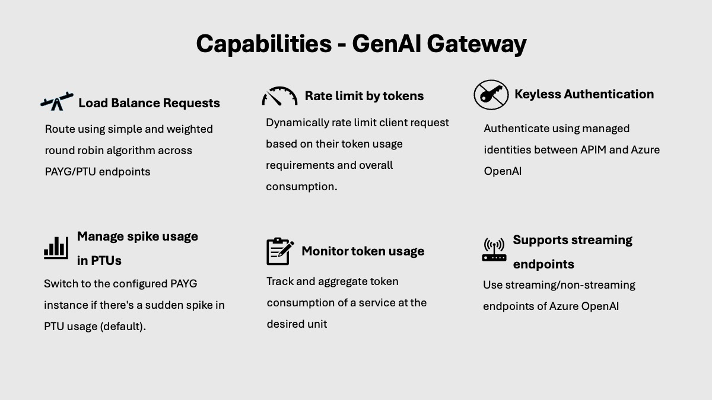

# Scenario 3: Azure API Management - Generative AI resources as backend

This reference implementation demonstrates how to provision and interact with Generative AI resources through API Management. The implementation is on top of the [APIM baseline](./../apim-baseline/README.md) and additionally includes private deployments of Azure OpenAI endpoints, and the policies for the [following capabilities](#genai-gateway-capabilities) that are specifically tailored for GenAI use cases.

By the end of this deployment guide, you would have deployed private Azure OpenAI endpoints and an opinionated set of policies in APIM to manage traffic to these endpoints. You can then test the policies by sending requests to the APIM gateway, and can modify either to include the policy fragments [listed here](#scenarios-handled-by-this-accelerator) or to include your own custom policies.

## Architecture

### Core components

- Azure OpenAI endpoints
- Azure Event Hub
- Azure Private Endpoint
- Azure Private DNS Zones

### GenAI Gateway capabilities

## Deploy the reference implementation

This reference implementation is provided with the following infrastructure as code options. Select the deployment guide you are interested in. They both deploy the same implementation.

:arrow_forward: [Bicep-based deployment guide](./bicep/README.md)
:arrow_forward: [Terraform-based deployment guide](./terraform/README.md)

## GenAI Gateway

A "GenAI Gateway" serves as an intelligent interface/middleware that dynamically balances incoming traffic across backend resources to achieve optimizing resource utilization. In addition to load balancing, GenAI Gateway can be equipped with extra capabilities to address the challenges around billing, monitoring etc.

To read more about considerations when implementing a GenAI Gateway, see [this article](https://learn.microsoft.com/ai/playbook/technology-guidance/generative-ai/dev-starters/genai-gateway/).

This accelerator contains APIM policies showing how to implement different [GenAI Gateway capabilities](#genai-gateway-capabilities) in APIM, along with code to enable you to deploy the policies and see them in action.

### Scenarios handled by this accelerator

This repo currently contains the policies showing how to implement these GenAI Gateway capabilities:

| Capability                                                                      | Description                                                             |
| ------------------------------------------------------------------------------- | ----------------------------------------------------------------------- |
| [Load balancing (round-robin)](./policies/fragments/load-balancing/README.md) | Load balance traffic across PAYG endpoints using simple and weighted round-robin algorithm. |
| [Managing spikes with PAYG](./policies/fragments/manage-spikes-with-payg/README.md) | Manage spikes in traffic by routing traffic to PAYG endpoints when a PTU is out of capacity. |
| [Adaptive rate limiting](./policies/fragments/rate-limiting/README.md) | Dynamically adjust rate-limits applied to different workloads|
| [Tracking token usage](./policies/fragments/usage-tracking//README.md) | Record the token consumption for usage tracking and attribution|
| [Multi-tenancy](./policies/multi-tenancy/README.md)| Implementing multi-tenancy using Products and Product Policies|

### Test/Demo setup

If you are looking for a quick way to test or demo these capabilities with a minimalistic non production like APIM setup against a Azure OpenAI simulator, check out this repository.

:arrow_forward: [APIM GenAI Gateway Toolkit](https://github.com/Azure-Samples/apim-genai-gateway-toolkit)

## AI Hub Gateway capabilities

Looking for comprehensive reference implementation to provision your AI Hub Gateway? Check out AI Hub Gateway scenario.

:arrow_forward: [AI Hub Gateway](https://github.com/Azure-Samples/ai-hub-gateway-solution-accelerator)
