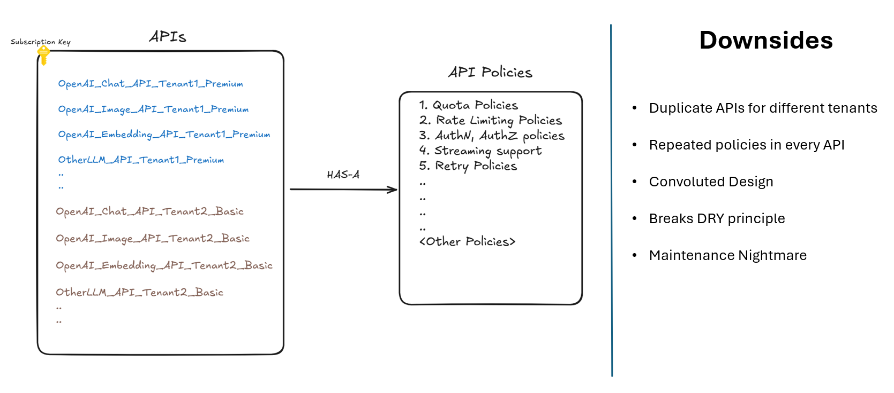
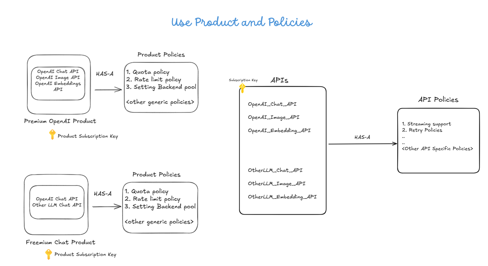

# Multi-Tenancy using Azure API Management

Customers may sometimes would also like to have a multi-tenancy model on top of their backend APIs.
This is a typical requirement for customers/businesses operating in SaaS based models, which is essentially defined using following 2 business concepts:

1. **Tiers**:
Tiers govern the _quality of service_ exposed based on the pricing model.
For instance, a _Freemium_ tier can be thought of as for consumer groups who would like to explore the service at no cost and with very limited quota and rate limiting , likewise a _Premium_ tier can be defined for consumers who would like to have the most premium service experience with the maximum possible rate limiting and quota.

2. **Entitlements**: Apart from _tiers_, businesses would also like to define _entitlements_ which means _giving access of only selected APIs_ for a particular consumer group. For instance, access to only chat based APIs for consumer A or embedding only APIs for consumer B.

An initial solution can be thought of by defining separate APIs for different customers based on their _tiers_ and defining the policies at the API level. Following image describes this appraoch.

However, as we can easily observe this solution results in a lot of redundancy of APIs and API policies and a very convoluted design. Also, it's hard to define entitlements using this model.

A better and effective solution can instead be built by leveraging the concept of APIM "Products" which would help us to cater our  _entitlement_ requirement by grouping APIs related to that specific entitlement in a logical container and cater to our requirement of _tier_ by leveraging Product's policies for the respective tier (like quota, rate limiting along with the respective backend model for e.g.: either a PAYG or PTU), and by defining "subscriptions" at the Product level and giving access of Product subscription IDs to the end user group, the users can only interact with the service via the specific product for which they have the subscription to.

This solution not only helps to cater to the multi-tenancy requirement in an effective manner but also makes the overall solution design modular and extensible by having the capability to define n-number of products and APIs and their combinations.

Following blog post further describes this problem and solution approach in more detail -
https://devblogs.microsoft.com/ise/multitenant-genai-gateway-using-apim/

_Note:
As this a general pattern, this solution is not specifically tied to the GenAI backened scenario but can be used with any general API backend._

## Products and Policies

- Products: Acts as logical container of APIs that should be part of a specific entitlement (e.g., Chat APIs for a chat-based entitlement). As Product here is another APIM resource, sample code for defining a Product & Product API association is in the bicep/terraform scripts.

- Product Policies: For defining tier-wise policies (e.g., rate limits, quotas).

Policy reference: [`example-product-policy.xml`](example-product-policy.xml)

The policy defines following elements:

- A backend pool variable: For e.g.: if it's a Freemium Tier product
        then this can be a PAYG pool, similarly if it's a Premium Tier product, then it can be a PTU pool.
- A standby pool variable
- Quota and Rate limiting policies using subscriptionId as counterKey
