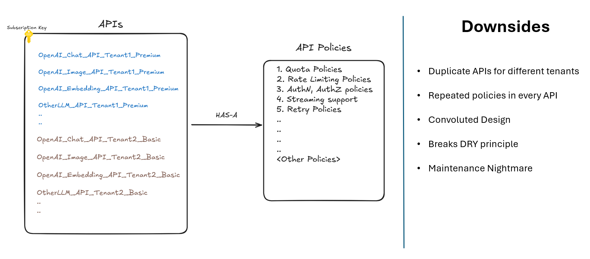
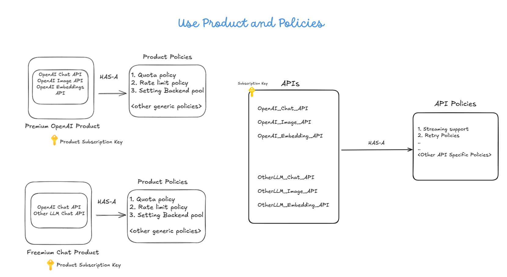

# Multi-Tenancy using Azure API Management

Customers may sometimes would also like to have a multi-tenancy model on top of their backend APIs.
This is a typical requirement for customers/businesses operating in SaaS-based models. Multi-tenancy in such scenarios is typically defined using following two business concepts:

1. **Tiers**:
Tiers govern the _quality of service_ exposed to the users based on their pricing model.
For instance, a _Freemium_ tier can be thought of as for consumer groups who would like to explore the service at no cost thus having very limited quota and rate limiting, likewise a _Premium_ tier can be defined for consumers who would like to have the most premium-grade service experience with the maximum possible rate limiting and quota.

2. **Entitlements**: Apart from _tiers_, businesses would also like to define _entitlements_ ,which means _giving access of only selected APIs_ for a particular consumer group. For instance, access to only chat based APIs for consumer A or only image APIs for consumer B.

## Initial Approach

An initial approach can be to define separate APIs for different customers based on their _tiers_ & _entitlement_ combinations by defining the policies at the API level.The following image describes this approach -

### Downsides

As we can clearly observe, this solution results in a lot of redundancy of APIs and API policies, overall resulting in a very convoluted design. The API policy code is also now bloated with unnecessary responsibilities which does not fall under the scope of API(for e.g., with the above design, any new policy we want to include has to be defined as part of the API policies). Further, it's also hard to define the entitlements using this model.

## Solution Approach

A better and effective solution can be built by leveraging the concept of APIM [Products](https://learn.microsoft.com/en-us/azure/api-management/api-management-howto-add-products?tabs=azure-portal&pivots=interactive), helping us to cater to our "_entitlement_" requirement by grouping APIs related to that specific entitlement in a logical container and cater to our requirement of "_tier_" by leveraging Product's policies for the respective tier (like quota, rate limiting along with the respective backend model for e.g.: either a PAYG or PTU). Lastly, by defining [subscriptions](https://learn.microsoft.com/en-us/azure/api-management/api-management-subscriptions) at the Product level and giving access of only the Product's subscriptions to the end-user group, the users can only interact with the service via the specific Product's subscription.
Following design demonstrates this approach further -

Product policy essentially here is helping us to define our "tenant" specific policies.

### Benefits

This solution not only helps to cater to the multi-tenancy requirement in an effective manner but also makes the overall design modular and extensible by having the capability to define n-number of products and APIs and their different combinations with clear separation of concerns and adherence to the DRY(Do not Repeat Yourself) principle.

_Note:
As this a general pattern, this solution is not only limited to the GenAI backend but can be used with any general backend as well._

### References

Following blog post further describes this scenario in detail -
https://devblogs.microsoft.com/ise/multitenant-genai-gateway-using-apim/

## Products and Policies

To summarize:

- Products: Acts as logical container of APIs for a specific consumer group (e.g., Chat APIs or Embedding APIs).

- Product Policies: For defining tenant policies (e.g., rate limits, quotas).

And as part of this capability's example scenario, we will apply a new _quota policy_ at the product level, such that if the number of requests to APIM via that Product's subscription exceed as per the defined "calls" attribute value, then the product policy will accordingly block the subsequent requests from that subscription until the quota is refreshed based on the defined "renewal-period" and "counter-key" attributes.

For this setup, we create two sample products(`multi-tenant-product1`,`multi-tenant-product2`) with different counter keys(`<subscription_id>-mt-product1`,`<subscription_id>-mt-product2`) respectively and with the following policies :

- [`multi-tenant-product1-policy.xml`](multi-tenant-product1-policy.xml)
- [`multi-tenant-product2-policy.xml`](multi-tenant-product2-policy.xml)

The Product Policy can thus be extended with any number of higher-level policies (for e.g., defining quota or rate limits) and any attributes (for e.g., setting the name of the backend pool) as per the respective _tenant's_ requirement.

## Note

This capability/pattern is over the top of the existing core capabilities, which can be played around & tested separately and hence does not impact the existing setup.

However, ifmulti-tenancy capability is not needed i.e. these resources created as part of our deployment, then the respective code blocks can be commented from the bicep and terraform scripts.
